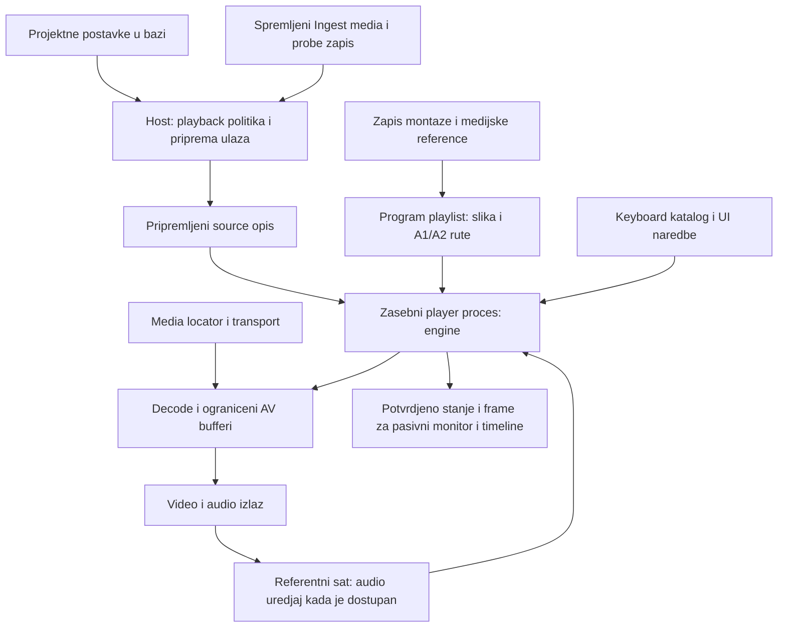

# Broadcast Player: v4 tijek i audio ulaz

Datum: 2026-09-09.
Novi kod: `C:\Users\miron\Projects\QNC`.
Stvarna v4 referenca: `C:\Users\miron\Projects\qnc_v4`.

## Opseg i metoda

Korisnik je suzio zadatak na Broadcast Player, pa tek onda ostalo.
Projects i Ingest pregledani su kao izvori postavki i spremljenih medijskih
podataka. Story/program put pregledan je radi A1/A2 semantike, ne radi razvoja
Story aplikacije. Ovo nije tvrdnja da je svaka linija cijelog v4 auditirana.

Pregledan je kod na disku, ukljucujuci necommitane izmjene u oba stabla,
ne samo HEAD niti raniji izvjestaji. Procitana su pravila obaju projekata.
Stvarna aktivna projektna baza provjerena je s `mode=ro` i `query_only`.
Nisu pokretani probe, import, playback ni testovi. Kod i baze nisu mijenjani;
promjene ovog audita ogranicene su na ovaj izvjestaj i ispravak docs/65.

## Kriticni nalazi

### P1: Postojece projektne audio postavke ne dolaze do playera

Stvarna baza aktivnog projekta `bbvvcx`, procitana kroz iste javne prikaze
koje koristi lokalni settings adapter, sadrzi:

```json
{
  "audio": {
    "channels": 2,
    "sample_rate": 48000,
    "transcribe_channel": "CH1",
    "atmosphere_channel": "CH2"
  },
  "playback": { "input": "proxy_if_available", "cache": { "mode": "off" } }
}
```

`export.audio_channels` takodjer je 2. To je zasebno polje, ne opravdanje da
potrosac proizvoljno zamijeni cijeli `audio` objekt export postavkama.
Baza je `C:\Users\miron\Test projekt\bbvvcx_14934338a30a4378a64903801dcc849a\qnc_project.db`.

Javni citac vec ucitava `audio`:
[WorkSettings](C:/Users/miron/Projects/QNC/crates/qnc-work-settings/src/model.rs:48),
[citanje settings_json](C:/Users/miron/Projects/QNC/crates/qnc-work-settings/src/local.rs:138).
Medjutim, [PreparedInput](C:/Users/miron/Projects/QNC/crates/qnc-player-input/src/lib.rs:95)
i [prepare](C:/Users/miron/Projects/QNC/crates/qnc-player-input/src/lib.rs:188)
prenose playback politiku i source snapshot, ali ne projektni audio izlaz.
[Playback adapter](C:/Users/miron/Projects/QNC/crates/qnc-ingest-components/src/playback.rs:53)
umjesto toga uzima `device_channels` iz `data/player-output.json`.

To je pogresan paralelni izvor odluke. Prvo popraviti postojeci put
DB -> javni citac -> pripremljeni ulaz -> player/audio izlaz.
Ne dodavati Project polja, novu bazu ili novu konfiguraciju.
Fizicki odabir uredjaja ne smije preuzeti projektni broj i uloge kanala.

### P1: Izvorni kanali, programski A1/A2 i uredjaj nisu isti ugovor

Korisnikov zadani broadcast model:
- A1: OFF novinara i izjave sugovornika.
- A2: ambijent pokrivalica/B-rolla.
- Projekt odredjuje audio postavke. Player ih izvrsava; ne izmislja ih.

Kamera moze imati 4 mono kanala, dok montaza ima 2 aktivna programska kanala.
To nije naredba za automatski zbroj svih kanala u stereo niti za trajno
odbacivanje CH3/CH4 iz izvornog zapisa. Izvorna frekvencija uzorkovanja i
timebase ostaju iz spremljenih media podataka; ciljna konfiguracija ne smije
samo preimenovati izvorni format bez stvarne pretvorbe kada je ona potrebna.

V4 [program playlist](C:/Users/miron/Projects/qnc_v4/qnc-program-playlist/src/lib.rs:358)
salje osnovni ton na A1; [pokrivalice](C:/Users/miron/Projects/qnc_v4/qnc-program-playlist/src/lib.rs:505)
salje na A2 i zadrzava A1 ispod zamijenjene slike. To potvrdjuje proceduru.
Ali v4 [audio_routes](C:/Users/miron/Projects/qnc_v4/qnc-program-playlist/src/lib.rs:511)
uzima `source_channel: 0`, a [host](C:/Users/miron/Projects/qnc_v4/qnc-host/src/program_playlist.rs:42)
postavlja `discrete(2)`. To nije dokaz potpune primjene projektnih postavki.

V4 [monitor helper](C:/Users/miron/Projects/qnc_v4/qnc-player-output/src/lib.rs:1100)
zbraja CH1+CH3 u lijevi i CH2+CH4 u desni izlaz za cetverokanalni ulaz.
To je zasebna implementacijska odluka, ne korisnikovo A1/A2 pravilo koje
treba kopirati. A1/A2 oznacavaju uloge programskog tona, ne stereo par kamere.
Broj kanala i tehnicki metadata sami ne dokazuju koji mikrofon nosi koju ulogu.

### P2: V4 odabir proxyja nije dokaz ispravnog proxy metapodatka

V4 [media/play.rs](C:/Users/miron/Projects/qnc_v4/qnc-host/src/media/play.rs:60)
cita `playback.input` iz efektivnih projektnih postavki.
[playback_probe_meta](C:/Users/miron/Projects/qnc_v4/qnc-host/src/media/play.rs:364)
zatim trazi jedan `ingest_assets.probe_json` po `clip_id`; isti lookup koristi
se i uz original i uz proxy putanju. Kada se njihove karakteristike razlikuju,
to nije dovoljan dokaz karakteristika otvorene reprezentacije.
To je rizik koda, ne dokaz da je konkretan klip na kartici ostecen.

Novi player vec cuva odvojene original/proxy zapise. To zadrzati.
Projektni format nije zamjena za source FPS; nedostajuci metadata nije dozvola
za drugi probe. Audio inventar originala nije zamjena za programsko routanje.

## Potvrdjeni v4 playback tijek



Ovo prikazuje v4 proceduru, ne odobrenje kopiranja njegova centralnog hosta.
U novom QNC-u DB ulaz priprema javni read-only modul, bez poznavanja Projects
ili Ingest aplikacije. Source i program su nacini istog playera, ne dva sata.
Program/A1/A2 ovdje objasnjava ulazni ugovor; ne otvara razvoj Story aplikacije.

V4 tragovi izvrsavanja:
- [player_remote](C:/Users/miron/Projects/qnc_v4/qnc-app/src/player_remote.rs:1375):
  pripremljeni source opis -> player proces; program put koristi isti runner.
- [runner](C:/Users/miron/Projects/qnc_v4/qnc-player-runner/src/main.rs:575):
  sastavlja engine i odvojene decode/output adaptere.
- [service](C:/Users/miron/Projects/qnc_v4/qnc-player-runtime/src/service.rs:177):
  vodi naredbe i tick izvan UI threada.
- [transport_engine](C:/Users/miron/Projects/qnc_v4/qnc-broadcast-player/src/transport_engine.rs:642):
  priprema AV redove prije pokretanja sata.
- [audio sink](C:/Users/miron/Projects/qnc_v4/qnc-player-runner/src/main.rs:2181):
  uredjaj daje referentni sat; put bez uredjaja koristi monotoni sat.
- [timeline](C:/Users/miron/Projects/qnc_v4/qnc-app/src/qnc_timeline_progress.rs:113)
  i [filmstrip](C:/Users/miron/Projects/qnc_v4/qnc-app/src/qnc_filmstrip_background.rs:1):
  prikaz i intent, ne drugi player, decode ili izvor vremena.

## Uskladjenje s pravilima i sljedeci zahvat

AGENTS 4.1 zahtijeva primjenu postojeceg projektnog zapisa, ne zamjensku
konfiguraciju. Recenica u 8.2 o zadanoj 1:1 mapi svih izvornih kanala ne smije
se primijeniti kao zamjena za izricito zadani projektni programski izlaz.
Novija korisnikova uputa ima prednost: projekt odredjuje broj audio kanala.
Docs/65 povlaci suprotan zakljucak; docs/64 nije odobrenje da se zaobidje DB.

Najmanji sljedeci zahvat, samo u postojecem playback putu:
1. Prenijeti postojece projektne audio postavke kroz javni player input ugovor.
2. Izvorne streamove zadrzati kao inventar, a izlaz pripremiti prema DB
   postavkama i eksplicitnim rutama; ne uvoditi automatski stereo miks.
3. Ukloniti zamjensku odluku iz `player-output.json` i njezin loader/manifest
   dio. Ne mijenjati Projects, scan, probe, import, Story ili layout.
4. Play pokrece vec pripremljeni player; Pause cuva pripremu. Klik drugog
   klipa gasi stari zvuk/sliku. Thumbnail ostaje u monitoru do Playa.
5. Koristiti postojeci keyboard action_id, pasivni monitor i playerov sat.

Ovo nije nova arhitektura ni dodatni centralni runtime. Popravlja se prijenos
ulaza postojecem javnom out-of-process Broadcast Playeru. Isti verzionirani
ugovor mora vrijediti Local/LAN/Intranet i Windows/Linux/macOS.

## Granica verifikacije

Potvrdjeni su citanje stvarne baze, kod koji gubi audio postavke, v4 source i
program playback put, audio rute i podjela engine/output/pasivni UI.
Nisu izmjereni novi Play latency ni fizicki A/V pomak. Nisu izvrseni live
Ingest, LAN/intranet, Linux/macOS ili workspace testovi u ovom audit prolazu.

Nakon odobrenog popravka provjera ide kroz stvarni Ingest: Mironik 2002 cijelom
duzinom, izbor drugog klipa, Play/Pause preko kataloga, oba odvojena audio
izlaza i izmjeren A/V pomak. Zapisati stvarna mjerenja; prolaz unit testa ili
brojac frameova nije dokaz trenutnog Playa, audio routanja ili sinkronizacije.
Sljedeci rizik je poistovjetiti cetiri kanala datoteke s dva programska izlaza
ili proglasiti player gotovim prije tog live testa. Ostalo ceka Broadcast Player.
