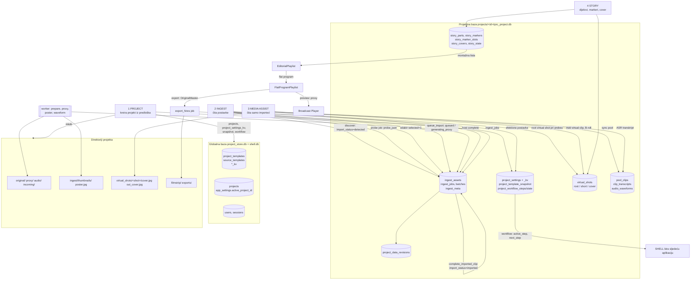
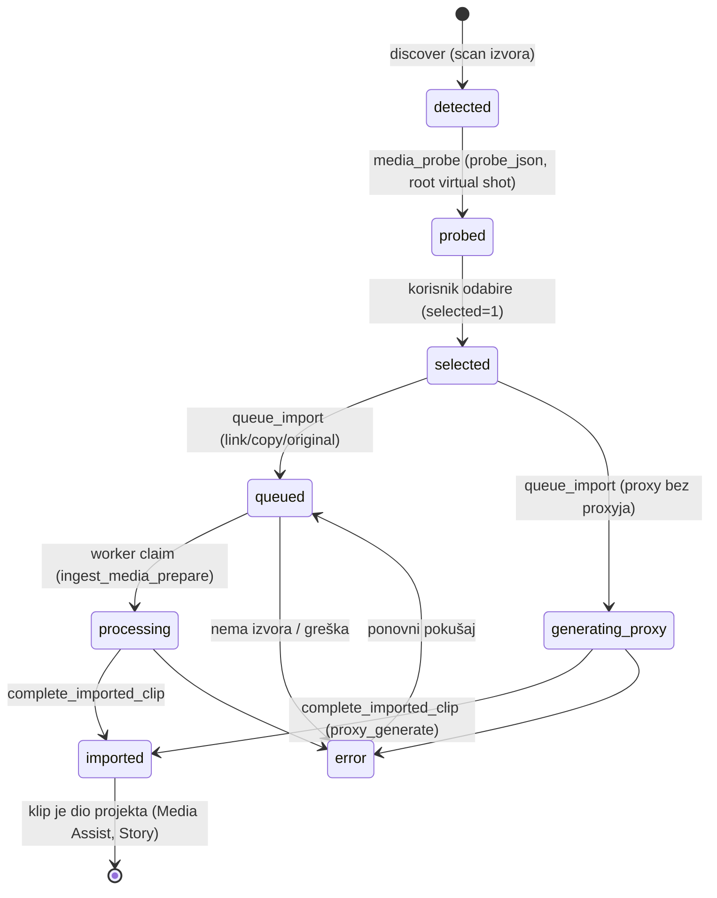

# Knjiga procedura i zapisa QNC v5

Izvor: `C:\Users\miron\Projects\QNC_v5` (`qnc-host`, `qnc-worker`, `qnc-service-contracts`, `qnc-program-playlist`, `qnc-app`). Samo čitano. Svrha: točka po točka opisati svaku proceduru (okidač, čita, piše, posljedice) i svaki zapis u bazi, kako bi se u našem sustavu ponovno izgradilo isto ponašanje, ali u našoj arhitekturi (zasebne aplikacije, baza kao jedina poveznica, javni moduli).

## Status izvora (odluka korisnika)

**v5 kod nije mjerodavan.** Ova knjiga bilježi *što je sustavu potrebno* (procedure, zapisi, pravila) onako kako ih je pokazao v5. Nije predložak za prepisivanje. Mjerodavno je, redom: (1) izričite odluke korisnika, (2) `AGENTS.md` i ugovori, (3) tek onda ponašanje v5. Gdje v5 protuslovi tome (npr. `pool_clips` kopija, klasa kadra iz naknadne oznake, potpis slota kao identitet, commit bez verzije, zapis izvora u konfiguracijsku datoteku), knjiga to označava kao **potrebu** bez preuzimanja v5 rješenja. Popis takvih točaka je u `08-gaps-and-mapping.md`.

## Sadržaj

| Datoteka | Sadržaj |
|---|---|
| `00-index-and-flow.md` | ovaj indeks, glavni dijagram toka, legenda, pokrivenost revizije |
| `01-project.md` | globalna baza, predlošci, kreiranje/otvaranje/brisanje projekta, postavke, tijek (workflow), sesije, korisničke postavke |
| `02-ingest.md` | izvor, otkrivanje, probe, odabir, uvoz, poster, serija uvoza |
| `03-media-assist.md` | media pool, virtualni kadrovi (root/short/cover), transkripti/ASR, editor asseti |
| `04-story.md` | operacije nad dijelovima, markerima, slotovima, pokrivalicama, potvrdom; montažna lista |
| `05-jobs-workers-export.md` | red poslova, lease/heartbeat, tipovi poslova, workeri, export, playback cache |
| `06-data-dictionary.md` | sve tablice: baza, vlasnik, stupci, tko piše |
| `07-api-inventory.md` | svih 107 ruta hosta po područjima |
| `08-gaps-and-mapping.md` | razlike prema našem sustavu, ispravci ranijih dokumenata, otvorena pitanja |

Povezano (ranije, uže): docs 89–96.

## Legenda

- **Okidač**: što pokreće proceduru (korisnik/API, drugi posao, host timer).
- **Čita / Piše**: `tablica.stupac`; `FS:` = datoteke/direktoriji.
- **Vlasnik**: područje čiji kod smije pisati tablicu (u v5 to nije provedeno tehnički, jedna projektna baza).
- **[nije pročitano]**: procedura postoji, ali njezina unutrašnjost nije pregledana do kraja u ovoj reviziji; navedeno je samo ono što je potvrđeno (potpis, poziv, tablice iz mehaničkog popisa SQL-a).
- Sve tvrdnje označene „(zaključak)” izvedene su iz koda, nisu izvršene.

## Pokrivenost revizije (iskreno)

| Dio | Način |
|---|---|
| Svi SQL zapisi (`INSERT/UPDATE/DELETE/CREATE/ALTER`) u `qnc-host`, `qnc-worker`, `qnc-app`, `qnc-client`, contracts, playlist (289 pojava, 47 tablica) | **mehanički izvučeni**, grupirani po tablici i funkciji (06) |
| Svih 107 API ruta | mehanički izvučene (07); za većinu je funkcija pročitana |
| Project (kreiranje, predlošci, postavke, workflow, sesije) | pročitano |
| Ingest: discover, registracija, selekcija, probe zapis, queue_import, import_finish, pipeline serije, jobs (claim/complete za media prepare i proxy) | pročitano |
| Ingest: `poster_copy`, `thumb.rs`, `proxy_encode`, `audio_wrap`, `waveform` generiranje, `original_archive_copy` | [nije pročitano] do unutrašnjosti; poznati su okidači, tablice i rezultati |
| Media pool, virtual_shots (root, short, derive, cover), transkripti | pročitano (ASR unutrašnjost [nije pročitano]) |
| Story (dijelovi, markeri, slotovi, cover, montažna lista, program) | pročitano (docs 93, 94) |
| Export HI-res (host strana) | pročitano; worker render [nije pročitano do kraja] |
| Shell/UI (`qnc-app`) | pročitane radnje Storyja i markera; ostali zasloni samo popis |

## Glavni dijagram toka (baza je jedina poveznica)

## Tok jednog klipa (životni ciklus)

## Ključna načela iz koda (sažetak)

1. **Jedna projektna baza** (`qnc_project.db`), tablice po područjima dodaju se `CREATE TABLE IF NOT EXISTS` pri prvom otvaranju (`open_project` → `init_project_schema`; `open_ingest`, `story::ensure_schema`, `media_pool::open_db`, `virtual_shots::ensure`).
2. **Klip je dio projekta tek kad je `import_status = imported`** (Media Assist i Story čitaju samo takve).
3. **Uvoz se pokreće samo iz baze** (`ingest_assets.selected`), ne iz sadržaja zahtjeva.
4. **Što se kopira odlučuju postavke projekta** (`storage.ingest_media`, `storage.original_policy`, `playback.input`).
5. **Korijenski virtualni kadar nastaje pri probeu** (Ingest), ne u Media Assistu.
6. **Story tablice čuvaju frameove izvora**; montažna lista, program, preview i export izvode se iz njih.
7. **Revizija podataka** (`project_data_revisions`) podiže se samo za opseg `ingest`.
8. **Workflow (`project_workflow_steps`) se postavlja pri kreiranju projekta; koda koji pomiče korak naprijed nema.**
